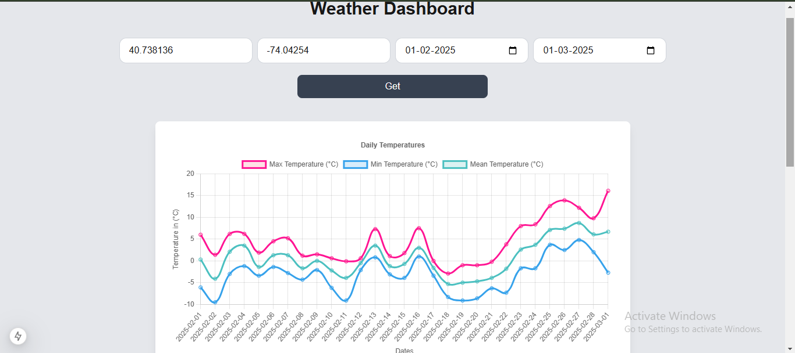
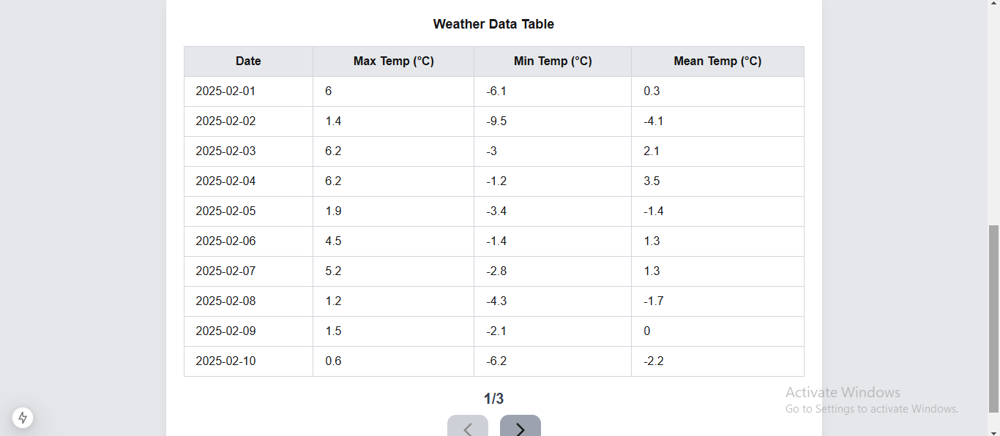

# Weather Visualization Dashboard

This project is a **Weather Visualization Dashboard** built with **Next.js**, **Chart.js**, and **Tailwind CSS**. The application allows users to fetch historical weather data from the Open-Meteo Historical Weather API and visualize it through interactive graphs and tables with pagination.

---

## 📸 Screenshots

### 🔹 1.  


### 🔹 2.  


## Features

- **Responsive UI**: Built with Tailwind CSS, ensuring compatibility across devices.
- **Weather Data Visualization**: Displays historical weather data using Chart.js for graphical representation.
- **Table with Pagination**: View data in tabular format with 10 rows per page, with "Previous" and "Next" page navigation.
- **Dynamic Inputs**: Specify location coordinates (latitude, longitude) and date range for fetching weather data.
- **Error Handling**: Carefully manages invalid inputs and API errors.
- **Loading State**: Displays a loading indicator while data is being fetched.

---

## Technologies Used

- **Next.js**: For server-side rendering and building the React-based application.
- **Chart.js**: For creating interactive and responsive graphs.
- **Tailwind CSS**: For styling and responsive design.
- **Open-Meteo API**: To fetch historical weather data.

---

## Setup Instructions

Follow these steps to set up and run the project locally:

### 1. Clone the Repository

```bash
git clone https://github.com/binayak597/weather-visualization-dashboard.git
cd weather-visualization-dashboard
```

### 2. Install Dependencies
Make sure you have Node.js and npm or yarn installed. Then run:
```bash
npm install
```
or
```bash
yarn install
```
### 3. Set Up the Environment
Create a .env.local file in the project root and add the following environment variables:

```bash
NEXT_PUBLIC_API_BASE_URL=https://api.open-meteo.com/v1/forecast
```
### 4. Start the Development Server
Run the following command to start the server:

```bash
npm run dev
```
or
```bash
yarn dev
```
The application will be available at http://localhost:3000.

## How to Use
1. Enter Location: Provide the latitude and longitude of the location in the input fields.
2. Select Date Range: Use the date pickers to specify the start and end dates for the weather data.
3. View Graph: The fetched data is displayed as a line chart.
4. View Table: Scroll through the data in tabular format with pagination feature.


## API Integration
The application fetches weather data from the Open-Meteo Historical Weather API. The following parameters are used:
- Latitude and Longitude: Specify the location.
- Date Range: Select historical data range.
- Weather Variables: Fetch maximum, minimum, and mean temperatures.

Example API request:
```bash
https://api.open-meteo.com/v1/forecast?latitude=40.738136&longitude=-74.04254&daily=temperature_2m_max,temperature
```
- choose your own latitude and longitude value for better experience

